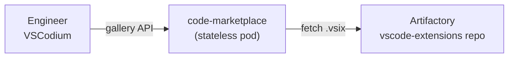

# code-marketplace

VS Code Marketplace-compatible gallery for Gov Cloud — Artifactory-backed, stateless. Engineers point VSCodium at this service and get a working **Extensions** tab without internet access to `marketplace.visualstudio.com`.

## Quick reference

|  |  |
|---|---|
| **Upstream** | https://github.com/coder/code-marketplace |
| **Image** | `ghcr.io/coder/code-marketplace:v2.5.0` |
| **Storage backend** | Artifactory generic-local repo `vscode-extensions` |
| **Namespace** | `code-marketplace` |
| **Ingress host** | `vscode-marketplace.<BASE_DOMAIN>` |
| **State** | Stateless — no PVC, no DB |
| **Client requirement** | VSCodium or Code-OSS (not stock MS VS Code) |

## Deploy

Full step-by-step walkthrough: **[code-marketplace.md](./code-marketplace.md)**

Experienced operators:

```bash
./scripts/pull-extensions.sh        # connected side
# transfer extensions/ + image to Gov side, then:
./scripts/deploy.sh
./scripts/seed-extensions.sh
./scripts/check-status.sh
```

Required env vars: `ACR_NAME`, `BASE_DOMAIN`, `ARTIFACTORY_URL`, `ARTIFACTORY_TOKEN`.

## File inventory

| File | Purpose |
|---|---|
| `code-marketplace.md` | Step-by-step deploy guide (read this first for the actual deploy) |
| `service.json` | Chart name, namespace, secret list |
| `service.conf` | Env config consumed by `scripts/deploy.sh` |
| `values.yaml` | Helm values template (`envsubst`'d at deploy) |
| `params.dev-airgap.bicepparam` | Bicep params (no Azure infra needed for this service — placeholder for consistency) |
| `images.txt` | Container image to mirror to Gov ACR |
| `extensions.txt` | Curated list of approved VS Code extensions |
| `charts/code-marketplace/` | Custom Helm chart (Deployment, Service, Ingress) |
| `scripts/` | Operations entry points (see below) |
| `extensions/` | Local `.vsix` cache (gitignored) |

## Scripts

| Script | Side | Purpose |
|---|---|---|
| `pull-extensions.sh` | Connected | Download approved `.vsix` from Marketplace into `extensions/` |
| `deploy.sh` | Gov | Helm install/upgrade |
| `seed-extensions.sh` | Gov | Bulk-upload `.vsix` from `extensions/` to Artifactory |
| `update-extension.sh` | Gov | Upload one `.vsix` to Artifactory |
| `backup.sh` | Gov | Snapshot Artifactory repo to local `tar.gz` |
| `restore.sh` | Gov | Restore `tar.gz` archive into Artifactory |
| `check-status.sh` | Gov | Probe deployment + gallery API |

## Day-2 ops at a glance

| Task | Command |
|---|---|
| Add / update an extension | Edit `extensions.txt` → `pull-extensions.sh` → transfer → `update-extension.sh <file>` |
| Upgrade the gateway binary | Bump `image.tag` in `values.yaml`, mirror new image, re-run `deploy.sh` |
| Backup | `./scripts/backup.sh` (then move archive to durable storage) |
| Restore | `./scripts/restore.sh <archive>` |
| Check health | `./scripts/check-status.sh` |

## Architecture (one diagram)



Backup/restore, deploy phases, and the troubleshooting decision tree are all in `code-marketplace.md`.

## Status

| Environment | State | Version |
|---|---|---|
| Dev (connected) | Not yet deployed | — |
| Dev (Gov air-gap) | Not yet deployed | — |
| Prod (Gov) | Not planned | — |

## Known issues

_(none yet — populate as you encounter them)_