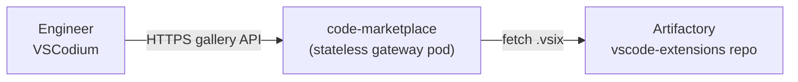
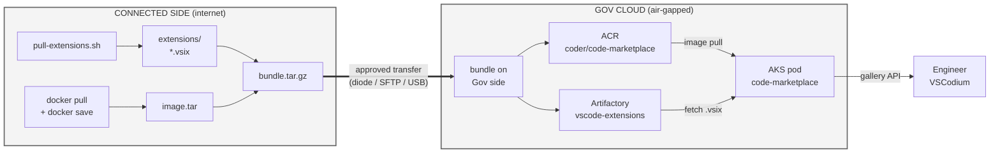
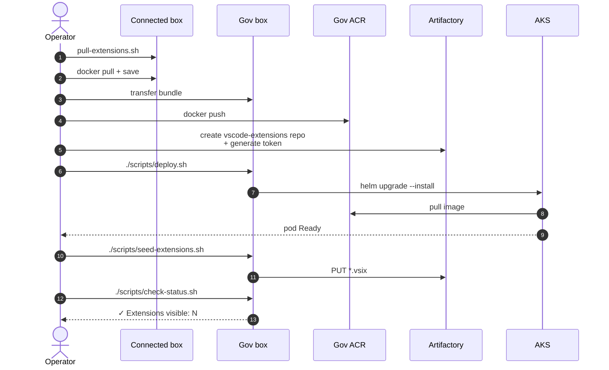
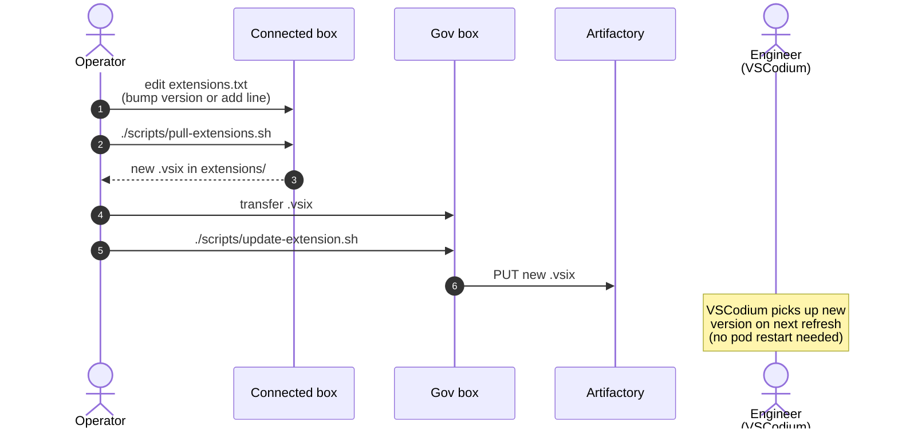
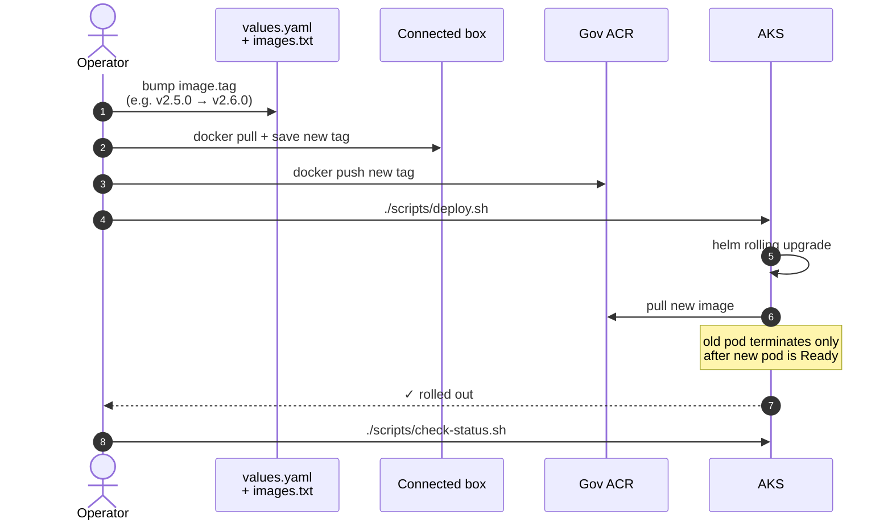
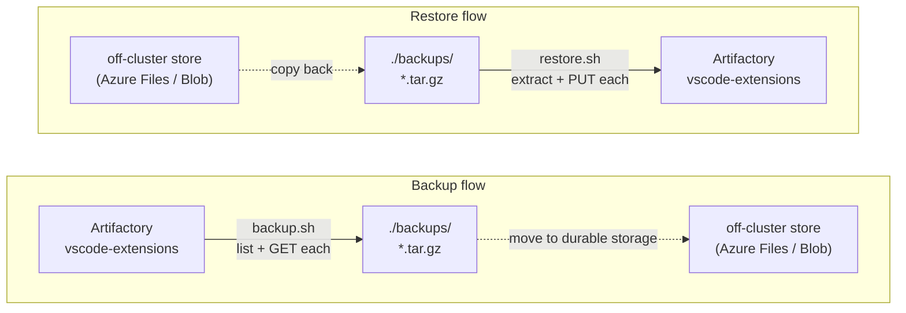
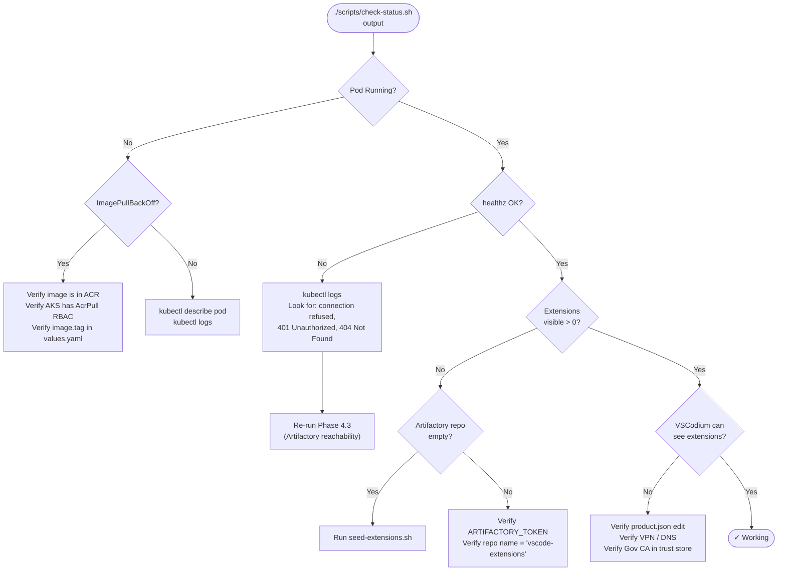

# Deploying code-marketplace

A step-by-step guide for deploying the VS Code extension gallery to AKS in Azure Government Cloud.

> **Audience:** anyone on the team. No prior context with this service required. If you can run `kubectl` and `helm`, you can do this.

---

## What this is

`code-marketplace` is a small Go service that gives engineers a working **Extensions tab** inside their editor — even though Gov Cloud has no internet access to `marketplace.visualstudio.com`. It serves a Microsoft-Marketplace-compatible gallery API from a curated set of `.vsix` files stored in our Artifactory.



**Key facts:**
- **Stateless** — the pod has no persistent volume. All state lives in Artifactory.
- **Air-gapped** — works in Gov Cloud with no upstream marketplace access.
- **Anonymous read** — VS Code clients can't authenticate to the gallery API. Access control is network-only (private endpoint or VPN).
- **VSCodium required** — stock Microsoft VS Code can't legally point at a non-Marketplace gallery. Engineers must use [VSCodium](https://vscodium.com/) or a Code-OSS fork.

---

## TL;DR for experienced operators

```bash
# Connected side
./scripts/pull-extensions.sh
docker pull ghcr.io/coder/code-marketplace:v2.5.0

# Transfer extensions/ + the docker image to Gov side, then on Gov:
docker push ${ACR_NAME}.azurecr.us/coder/code-marketplace:v2.5.0
# Create Artifactory generic-local repo "vscode-extensions" + a token (UI or REST)
export ACR_NAME=...  BASE_DOMAIN=...  ARTIFACTORY_TOKEN=...
./scripts/deploy.sh
ARTIFACTORY_URL=https://artifactory.${BASE_DOMAIN} ./scripts/seed-extensions.sh
./scripts/check-status.sh
```

If anything in the TL;DR is unclear, follow the full guide below.

---

## Prerequisites

You need:

| What | Where | How to verify |
|---|---|---|
| `kubectl` configured against the Gov AKS cluster | Gov side | `kubectl get nodes` returns nodes |
| `helm` v3 installed | Gov side | `helm version` |
| `docker` (or `podman`) installed | Both sides | `docker version` |
| `az` CLI logged into Gov tenant | Gov side | `az account show` |
| `curl` and `jq` installed | Both sides | `curl --version && jq --version` |
| Network reachability to Artifactory from inside the cluster | Gov side | See "Verify Artifactory reachability" below |
| **Write** access to the Gov ACR | Gov side | `az acr login -n <ACR_NAME>` works |
| **Admin** or **Repository Manager** access in Artifactory | Gov side | You can create a generic repo |
| Internet access | Connected side | `curl -I https://marketplace.visualstudio.com` returns 200 |

You also need three values that you'll set as environment variables. **Get these from your Azure / platform team**:

| Variable | Example | What it is |
|---|---|---|
| `ACR_NAME` | `govacrcompany` | The name (not full URL) of the Gov ACR registry |
| `BASE_DOMAIN` | `apps.example.gov` | The DNS suffix for cluster-exposed services |
| `ARTIFACTORY_URL` | `https://artifactory.apps.example.gov` | Public URL of Artifactory |
| `ARTIFACTORY_TOKEN` | (long string) | Artifactory access token — see Phase 4 |

---

## The big picture



**The flow, in plain English:**
1. Connected side pulls `.vsix` files and the container image from public sources.
2. Bundle is transferred to Gov side via your approved method (data diode, SFTP, USB, etc.).
3. On Gov side: image goes into ACR, `.vsix` files go into Artifactory.
4. Helm deploys the gateway pod, which reads from Artifactory and serves VSCodium clients.

### Operator action sequence



---

## Phase 1 — Connected side: gather artifacts

Run these on a connected machine that can reach `marketplace.visualstudio.com` and `ghcr.io`.

### 1.1 Clone the repo

```bash
git clone <gitlab-url-of-services-repo> services
cd services/services/code-marketplace
```

### 1.2 Review the extension list

Open `extensions.txt`. This is the curated list of approved extensions. Each line is `<publisher>.<name>@<version>`.

```bash
cat extensions.txt
```

If you need to add or change extensions:
1. Find the publisher/name/version on https://marketplace.visualstudio.com/
2. Add a line to `extensions.txt`
3. Commit the change to the repo

> **Tip:** Some extensions declare *dependencies* on other extensions (e.g., `ms-python.python` pulls in `ms-python.vscode-pylance`). Those dependencies must also be in `extensions.txt`, or installs will silently fail in VSCodium.

### 1.3 Pull the .vsix files

```bash
./scripts/pull-extensions.sh
```

Expected output:

```
  pulling ms-python.python@2024.22.0
  pulling golang.go@0.42.0
  ...
Summary: pulled=6  skipped=0  failed=0

Files in extensions/:
-rw-r--r--  1 user  staff   23M extensions/ms-python.python-2024.22.0.vsix
...
```

Each `.vsix` is a few MB to ~100 MB (large extensions like Python or Java can be hefty).

### 1.4 Pull the container image

```bash
docker pull ghcr.io/coder/code-marketplace:v2.5.0
docker save ghcr.io/coder/code-marketplace:v2.5.0 -o code-marketplace-v2.5.0.tar
```

You now have a `.tar` of the image ready to transfer.

### 1.5 Bundle for transfer

```bash
tar -czf code-marketplace-bundle.tar.gz \
  extensions/ \
  code-marketplace-v2.5.0.tar
```

You should now have one file (`code-marketplace-bundle.tar.gz`) to move to the Gov side.

---

## Phase 2 — Transfer to the Gov side

Use your team's approved transfer method:
- Approved data diode
- SFTP via bastion
- Secure USB
- Whatever your security team has signed off on

Place the bundle on a Gov-side machine that has:
- `kubectl` against the Gov cluster
- `docker` (or `podman`) and `az` CLI
- Network reachability to Gov ACR and Artifactory

Then unpack:

```bash
mkdir -p ~/code-marketplace-deploy
cd ~/code-marketplace-deploy
tar -xzf code-marketplace-bundle.tar.gz
ls -la
# extensions/  code-marketplace-v2.5.0.tar
```

Also clone (or copy) the repo on the Gov side:

```bash
git clone <gov-side-services-repo> services
cd services/services/code-marketplace
# Copy the unpacked extensions/ into this directory
cp -r ~/code-marketplace-deploy/extensions/* extensions/
```

---

## Phase 3 — Gov side: mirror image to ACR

Set your environment variables. **Replace the example values with real ones.**

```bash
export ACR_NAME=govacrcompany               # your Gov ACR name
export BASE_DOMAIN=apps.example.gov         # your cluster's DNS suffix
```

Log in to ACR:

```bash
az acr login -n "$ACR_NAME"
```

Expected output: `Login Succeeded`.

Load the image and push:

```bash
cd ~/code-marketplace-deploy
docker load -i code-marketplace-v2.5.0.tar
docker tag ghcr.io/coder/code-marketplace:v2.5.0 \
           "$ACR_NAME.azurecr.us/coder/code-marketplace:v2.5.0"
docker push "$ACR_NAME.azurecr.us/coder/code-marketplace:v2.5.0"
```

**Verify** the image is in ACR:

```bash
az acr repository show-tags -n "$ACR_NAME" --repository coder/code-marketplace -o table
```

Expected output:
```
Result
------
v2.5.0
```

---

## Phase 4 — Gov side: set up Artifactory

The pod needs a place to store `.vsix` files. We use an Artifactory **generic-local** repo.

### 4.1 Create the generic-local repo

**Option A — Artifactory UI** (easiest):

1. Open Artifactory in a browser.
2. **Administration ▸ Repositories ▸ Repositories**.
3. Click **Add Repositories ▸ Local Repository**.
4. **Package Type:** Generic
5. **Repository Key:** `vscode-extensions`
6. Click **Save & Finish**.

**Option B — REST API**:

```bash
export ARTIFACTORY_URL=https://artifactory.apps.example.gov
export ARTIFACTORY_ADMIN_TOKEN=...   # admin token, only needed for repo creation

curl -fsS -X PUT \
  -H "Authorization: Bearer $ARTIFACTORY_ADMIN_TOKEN" \
  -H "Content-Type: application/json" \
  "$ARTIFACTORY_URL/artifactory/api/repositories/vscode-extensions" \
  -d '{
    "key": "vscode-extensions",
    "rclass": "local",
    "packageType": "generic",
    "description": "VS Code extensions served via code-marketplace"
  }'
```

Expected response: `Successfully created repository 'vscode-extensions'`.

### 4.2 Generate an access token

The `code-marketplace` pod uses this token to read `.vsix` files from the repo.

**Option A — Artifactory UI**:

1. Click your user avatar (top right) ▸ **Edit Profile**.
2. **Generate Identity Token** with description `code-marketplace`.
3. **Save the token now** — you can't view it again.

**Option B — REST API** (creates a token tied to a service user):

```bash
curl -fsS -X POST \
  -H "Authorization: Bearer $ARTIFACTORY_ADMIN_TOKEN" \
  "$ARTIFACTORY_URL/access/api/v1/tokens" \
  -d "username=code-marketplace&scope=applied-permissions/user&expires_in=0" \
  | jq -r '.access_token'
```

Save the output as `ARTIFACTORY_TOKEN`:

```bash
export ARTIFACTORY_TOKEN=...
```

### 4.3 Verify Artifactory reachability from inside the cluster

The deployment talks to Artifactory over the cluster network. Confirm it can reach the service:

```bash
kubectl run -it --rm probe --image=curlimages/curl --restart=Never -- \
  curl -sI http://artifactory.artifactory.svc.cluster.local/artifactory/api/system/ping
```

Expected output ends with `HTTP/1.1 200 OK` (or `200` somewhere in the response).

If this fails, **stop here** and resolve cluster networking before continuing — every deploy step beyond this assumes the pod can reach Artifactory.

---

## Phase 5 — Gov side: deploy

Make sure all three env vars are set:

```bash
echo "ACR_NAME=$ACR_NAME"
echo "BASE_DOMAIN=$BASE_DOMAIN"
echo "ARTIFACTORY_TOKEN=$(echo $ARTIFACTORY_TOKEN | head -c 8)..."
```

Run the deploy script:

```bash
cd services/services/code-marketplace
./scripts/deploy.sh
```

What this does, in order:
1. Creates the `code-marketplace` namespace if absent.
2. Labels it `istio.io/rev=asm-1-27` for Istio sidecar injection.
3. Creates/updates the `code-marketplace-artifactory` secret with the token.
4. Renders `values.yaml` with `envsubst` (substituting `$ACR_NAME` and `$BASE_DOMAIN`).
5. Runs `helm upgrade --install` on the local chart in `charts/code-marketplace/`.
6. Waits for the rollout to complete.

Expected output ends with:

```
deployment "code-marketplace" successfully rolled out
✓ code-marketplace deployed to namespace=code-marketplace
```

If `helm upgrade` fails, see **Troubleshooting** below.

---

## Phase 6 — Gov side: seed extensions

Now upload the `.vsix` files into Artifactory.

```bash
export ARTIFACTORY_URL=https://artifactory.${BASE_DOMAIN}
# ARTIFACTORY_TOKEN should already be set from Phase 4

./scripts/seed-extensions.sh
```

Expected output:

```
✓ Uploaded ms-python.python-2024.22.0.vsix to vscode-extensions
✓ Uploaded golang.go-0.42.0.vsix to vscode-extensions
...
✓ Seeded 6 extensions
```

Verify they're in Artifactory:

```bash
curl -sH "Authorization: Bearer $ARTIFACTORY_TOKEN" \
  "$ARTIFACTORY_URL/artifactory/api/storage/vscode-extensions?list&deep=1" \
  | jq '.files | length'
```

Expected output: a number matching how many extensions you uploaded.

---

## Phase 7 — Gov side: verify

Run the status check:

```bash
./scripts/check-status.sh
```

Expected output:

```
── Pods ──
NAME                                  READY   STATUS    RESTARTS   AGE
code-marketplace-7d4c8f9b6-x2k4q      2/2     Running   0          2m

── Service ──
NAME              TYPE        CLUSTER-IP    EXTERNAL-IP   PORT(S)
code-marketplace  ClusterIP   10.0.x.y      <none>        3001/TCP

── Ingress ──
NAME              CLASS  HOSTS                              ADDRESS
code-marketplace  istio  vscode-marketplace.example.gov     <ingress-ip>

── Gallery probe ──
  ✓ healthz OK
  Extensions visible: 6
```

**If Extensions visible matches the number you seeded, deployment is complete.**

If you see `Extensions visible: 0`, Artifactory has the files but the pod can't reach them. Re-check Phase 4.3.

---

## Phase 8 — Engineer workstations: configure VSCodium

Each engineer who wants to use the gallery needs to point their VSCodium at our internal URL.

### 8.1 Install VSCodium

**Mac:**
```bash
brew install --cask vscodium
```

**Linux (Debian/Ubuntu):**
```bash
wget -qO - https://gitlab.com/paulcarroty/vscodium-deb-rpm-repo/raw/master/pub.gpg \
  | sudo gpg --dearmor -o /usr/share/keyrings/vscodium-archive-keyring.gpg
echo 'deb [signed-by=/usr/share/keyrings/vscodium-archive-keyring.gpg] https://download.vscodium.com/debs vscodium main' \
  | sudo tee /etc/apt/sources.list.d/vscodium.list
sudo apt update && sudo apt install codium
```

**Windows:** Download installer from https://vscodium.com/

### 8.2 Configure the gallery

Edit `product.json` in your VSCodium installation. Location:

| OS | Path |
|---|---|
| Mac | `/Applications/VSCodium.app/Contents/Resources/app/product.json` |
| Linux | `/usr/share/codium/resources/app/product.json` |
| Windows | `%LOCALAPPDATA%\Programs\VSCodium\resources\app\product.json` |

> **Note:** Editing this file requires admin/sudo. Make a backup first.

Find the `extensionsGallery` section (or add it if missing) and set:

```json
"extensionsGallery": {
  "serviceUrl": "https://vscode-marketplace.apps.example.gov/api",
  "itemUrl": "https://vscode-marketplace.apps.example.gov/item",
  "resourceUrlTemplate": "https://vscode-marketplace.apps.example.gov/files/{publisher}/{name}/{version}/{path}"
}
```

Replace `apps.example.gov` with your actual `BASE_DOMAIN`.

### 8.3 Restart VSCodium

Fully quit and reopen VSCodium. Open the **Extensions** tab (Cmd/Ctrl+Shift+X). You should see your seeded extensions.

### 8.4 Try installing one

Click any extension ▸ **Install**. The download should complete in a few seconds (it's coming from Artifactory inside the network, not the internet).

---

## Day-2 operations

### Add or update an extension



On the **connected side**:

1. Edit `extensions.txt` — add a new line or bump a version.
2. `./scripts/pull-extensions.sh` — pulls only the new/changed `.vsix`.
3. Transfer the new `.vsix` files to Gov side.

On the **Gov side**:

```bash
./scripts/update-extension.sh extensions/<new-file>.vsix
```

Or, if you transferred multiple, rerun `./scripts/seed-extensions.sh` (it will re-upload, which is harmless).

VSCodium clients will see the new version on next refresh — **no pod restart needed**.

### Update code-marketplace itself (binary upgrade)



1. Edit `images.txt` — bump the tag, e.g. `v2.5.0` → `v2.6.0`.
2. Edit `values.yaml` — change `image.tag` to match.
3. On connected side: `docker pull ghcr.io/coder/code-marketplace:v2.6.0` and transfer.
4. On Gov side: `docker push ${ACR_NAME}.azurecr.us/coder/code-marketplace:v2.6.0`
5. `./scripts/deploy.sh` — Helm rolls the deployment; old pod terminates after new one is healthy.

Verify with `./scripts/check-status.sh` — the same gallery probe should pass.

### Backup and restore



#### Backup

```bash
./scripts/backup.sh
# → ./backups/vscode-extensions-YYYYMMDD-HHMMSS.tar.gz
```

This downloads every `.vsix` from the Artifactory repo into a local tar.gz. **Move that archive to durable storage** — Azure Files, blob, or whatever your team uses for backups. The local `./backups/` directory is `.gitignore`'d and ephemeral.

For a production backup story, schedule this as a Kubernetes CronJob writing to a PVC backed by Azure Files (out of scope for this guide — track as a follow-up).

#### Restore

```bash
./scripts/restore.sh ./backups/vscode-extensions-YYYYMMDD-HHMMSS.tar.gz
```

This re-uploads every file in the archive to the Artifactory repo. Idempotent — running it on a non-empty repo overwrites entries with the same name.

VSCodium clients catch up on next request — no pod restart needed.

---

## Troubleshooting



### `helm upgrade` fails with "Unable to continue with install: existing resource conflict"

The chart was previously installed without Helm's tracking. Either delete the old resources or `helm install` with `--take-ownership`:

```bash
helm upgrade --install code-marketplace ./charts/code-marketplace \
  -n code-marketplace \
  -f /tmp/values-rendered.yaml \
  --take-ownership
```

### Pod won't start: `ImagePullBackOff`

Run:
```bash
kubectl -n code-marketplace describe pod -l app=code-marketplace | tail -30
```

If the error mentions `unauthorized` or `not found`:
- Verify image is in ACR: `az acr repository show-tags -n "$ACR_NAME" --repository coder/code-marketplace`
- Verify AKS has pull permission: AKS kubelet identity needs `AcrPull` on the ACR (one-time setup)
- Verify the tag in `values.yaml` matches what's in ACR

### Pod starts but `check-status.sh` shows `Extensions visible: 0`

The pod is running but can't talk to Artifactory or the repo is empty.

```bash
kubectl -n code-marketplace logs -l app=code-marketplace --tail=50
```

Look for:
- `connection refused` — pod can't reach `artifactory.artifactory.svc.cluster.local`. Check Phase 4.3.
- `401 Unauthorized` — token is wrong or expired. Regenerate and re-deploy.
- `404 Not Found` — the `vscode-extensions` repo doesn't exist. Recheck Phase 4.1.
- No errors but no extensions — Artifactory repo is empty. Run `./scripts/seed-extensions.sh`.

### VSCodium shows "We cannot connect to the Extensions Marketplace"

Run from the engineer's workstation:

```bash
curl -v https://vscode-marketplace.apps.example.gov/healthz
```

If this fails:
- DNS doesn't resolve: ensure the engineer is on the corporate VPN or on-network.
- TLS fails: cert may not be trusted; add the Gov CA to the engineer's trust store.
- 404: the ingress isn't picking up the host. Check `kubectl -n code-marketplace get ingress`.

If `curl` works but VSCodium still fails:
- Confirm `product.json` was edited correctly (no JSON syntax errors).
- Confirm VSCodium was fully restarted (not just window-reloaded).
- Tail the deployment logs while the engineer clicks Extensions: `kubectl -n code-marketplace logs -f -l app=code-marketplace`.

### Extension install fails: "Cannot find dependency"

The extension declares a dependency that isn't in our gallery.

1. Find the missing dependency in the `.vsix`: `unzip -p <file>.vsix extension/package.json | jq .extensionDependencies`
2. Add the dependency to `extensions.txt`.
3. Re-pull, re-transfer, re-seed.

---

## Rollback

If a deploy goes wrong and you need to revert:

```bash
# See helm history
helm -n code-marketplace history code-marketplace

# Roll back to the previous revision
helm -n code-marketplace rollback code-marketplace
```

If something is so broken Helm can't recover, nuke and redeploy:

```bash
helm -n code-marketplace uninstall code-marketplace
kubectl delete ns code-marketplace
# Then re-run Phase 5 (./scripts/deploy.sh)
```

The Artifactory repo is **not** affected by namespace deletion — your `.vsix` files are safe.

---

## Reference

| File | Purpose |
|---|---|
| `service.json` | Chart name, namespace, secret list |
| `values.yaml` | Helm values template (envsubst'd at deploy) |
| `params.dev-airgap.bicepparam` | Bicep params (no Azure resources for this service) |
| `images.txt` | Container images to mirror to Gov ACR |
| `extensions.txt` | Curated VS Code extensions to serve |
| `charts/code-marketplace/` | Custom Helm chart (Deployment, Service, Ingress) |
| `scripts/pull-extensions.sh` | Connected side: download .vsix from Marketplace |
| `scripts/deploy.sh` | Gov side: Helm install/upgrade |
| `scripts/seed-extensions.sh` | Gov side: bulk-upload .vsix to Artifactory |
| `scripts/update-extension.sh` | Gov side: upload one .vsix |
| `scripts/backup.sh` | Snapshot the Artifactory repo to a tar.gz |
| `scripts/restore.sh` | Restore a tar.gz into the Artifactory repo |
| `scripts/check-status.sh` | Probe deployment health and gallery API |

| Endpoint | Purpose |
|---|---|
| `https://vscode-marketplace.<BASE_DOMAIN>/healthz` | Health check (returns 200) |
| `https://vscode-marketplace.<BASE_DOMAIN>/api/...` | VS Code Marketplace gallery API |
| `https://artifactory.<BASE_DOMAIN>/artifactory/vscode-extensions/` | Underlying .vsix store (Artifactory) |

| Cluster resource | Name |
|---|---|
| Namespace | `code-marketplace` |
| Deployment | `code-marketplace` |
| Service | `code-marketplace` |
| Ingress | `code-marketplace` |
| Secret | `code-marketplace-artifactory` |

---

## Questions / hand-off notes

- **Who do I ask if Artifactory access is broken?** Whoever owns the Artifactory deployment. (Currently Jonathan.)
- **Where are the upstream docs?** https://github.com/coder/code-marketplace
- **Is this project actively maintained?** Yes (Coder maintains it as part of their cloud development environment product).
- **Can I add my own extensions for personal use?** The gallery is shared — adding requires editing `extensions.txt` and a re-seed. For personal extensions outside the curated set, install the `.vsix` manually with `code --install-extension /path/to/file.vsix` (bypasses the gallery).