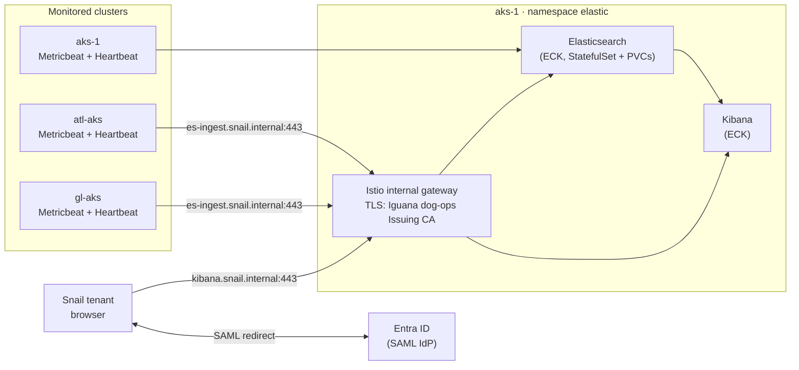

# elastic

Elastic Stack on **aks-1** (TEST, dog-ops), deployed with **Elastic Cloud on Kubernetes (ECK)**.
Elasticsearch and Kibana run on aks-1; Metricbeat and Heartbeat run on each monitored cluster
and ship back to aks-1. Kibana users sign in with Snail accounts via Entra ID SAML.

> **Status: design in progress — nothing deployed.** Blocked items are listed under
> *Open decisions*. `elastic.md` is the runbook; `TICKETS.md` is the tracking breakdown.

## Purpose

*As a Snail tenant, I want to be able to monitor TEST-specific uptimes and availability,
so that I can comply with SLAs and Cyber requirements.*

| AC | Criterion | Verified by |
|---|---|---|
| AC1 | Elastic is available as a data resource for tenant metric monitoring | ES cluster green on aks-1; Metricbeat + Heartbeat data arriving from aks-1, atl-aks, gl-aks |
| AC2 | Kibana is available as a data resource for tenant metric monitoring | Tenant signs in to `https://kibana.snail.internal` with their Snail account via SAML and sees the baseline uptime/availability dashboard |

## Scope

**In:** ECK operator + CRDs on aks-1 · Elasticsearch + Kibana with persistent storage ·
Kibana SAML with Entra ID and group→role mapping · Kibana and ES ingest endpoint exposed through
the aks-1 Istio internal gateway with certs from the **Iguana dog-ops Issuing CA** · network paths
from monitored clusters to aks-1 · Metricbeat + Heartbeat on aks-1, atl-aks, gl-aks, then Azure
metrics · baseline uptime/availability dashboard.

**Out:** log aggregation / SIEM · alerting and notification routing · APM · clusters outside
the fox-ops enclave.

## Architecture

## Decided

| | Value | Source |
|---|---|---|
| Deployment method | **ECK** (operator + CRDs) | ticket |
| Hub cluster | **aks-1**, dog-ops | ticket |
| ECK version | **3.5.0** | latest release |
| Stack version | **9.5.4** (Elasticsearch, Kibana, Metricbeat, Heartbeat) | latest 9.x release |
| Namespaces | `elastic` (stack), `elastic-system` (operator) | ECK convention |
| Hostnames | `kibana.snail.internal`, `es-ingest.snail.internal` (proposed — confirm) | `<svc>.snail.internal` pattern |
| Certificates | Iguana dog-ops Issuing CA — **name-constrained to `snail.internal`** | ticket |
| Kibana auth | SAML via Entra ID + a `basic` provider kept for break-glass | ticket |
| License | **Elastic Enterprise** — required for SAML | ticket |
| Monitored clusters | aks-1, atl-aks, gl-aks (then Azure metrics) | ticket |
| Transport port | 9300 excluded from the Istio sidecar | ECK Istio guidance |
| mmap | `node.store.allow_mmap: false` — avoids a privileged sysctl init container | locked-down AKS |
| Storage | **`managed-csi-premium-retain`** — Premium SSD, `Retain`, `WaitForFirstConsumer` (`manifests/storageclass.yaml`) | aks-1 `kubectl get storageclass`; every built-in disk class is `Delete` |

## Environment facts

> **⚠ UNVERIFIED FOR aks-1.** These were verified on the code-marketplace cluster, which is
> **not** aks-1. Treat every row as an assumption until checked on aks-1 — the mTLS mode in
> particular feeds open decision 1.

| | Value |
|---|---|
| Cloud | Azure Government |
| Istio revision | `asm-1-29` — namespace label `istio.io/rev=asm-1-29` |
| Istio mTLS | PERMISSIVE (observed) |
| Ingress | `aks-istio-ingress` ns, svc `aks-istio-ingressgateway-internal` |
| **Gateway TLS secrets** | live in **`aks-istio-ingress`**, not the app namespace |
| Sidecars | native — pods show `Init:1/2` permanently with `READY 1/1`. Normal. |
| Image transfer | `crane` with `--platform linux/amd64`; no docker on either host |
| ACR auth (air-gap) | `az acr login --expose-token` → `crane auth login` |

## Gotchas carried forward

- **9300 must bypass the sidecar.** Otherwise inter-node transport is encrypted twice and the
  cluster never forms. The annotations are in `manifests/elasticsearch.yaml`.
- **The CA can't sign cluster-local names.** Name-constrained to `snail.internal`, so no
  `*.svc.cluster.local` SANs — in-cluster TLS stays on ECK's own CA; Iguana certs only at the gateway.
- **Kibana refuses to start on unknown config keys.** Check every `config:` key against the 9.5 docs.
- **CRDs are too large for client-side apply.** Use `kubectl apply --server-side`.
- **Never put tarballs in a directory Helm or kubectl will read as manifests.** Cache lives in `cache/`.
- **Credentials never on a kubectl command line** — they land in container logs.
- **Entra group overage:** SAML tokens stop listing groups past ~150 memberships. Configure
  the enterprise app to emit only *groups assigned to the application*.

## Open decisions

1. **TLS model gateway → backends.** The gateway terminates Iguana certs; how does it reach
   ES/Kibana, which serve ECK's own TLS?
   - **A (recommended):** keep ECK TLS on; gateway re-originates TLS via `DestinationRule`
     trusting ECK's CA (copied to `aks-istio-ingress`, re-synced on ECK CA rotation).
     Encrypted end to end regardless of mesh mode.
   - **B:** disable ECK HTTP TLS; rely on Istio mTLS with a STRICT `PeerAuthentication` on
     `elastic`. ECK's documented Istio pattern, but then the operator namespace must be
     injected too, and the admission webhook port excluded.
2. **Tenant isolation.** Do tenants see only their own services (Kibana space per tenant +
   document-level security) or one shared view?
3. **Remote Beats delivery.** ECK operator is scoped to aks-1. On atl-aks / gl-aks, deploy
   Beats as plain manifests (recommended — no CRDs on every cluster) or install ECK there too?
4. **Sizing** — node count, disk per node, retention period. (StorageClass decided.)
5. **Azure metrics** — needs Azure Monitor API egress from aks-1 and a service principal.

## File index

| File | Purpose |
|---|---|
| `elastic.md` | Deploy runbook |
| `TICKETS.md` | Epic breakdown — one entry per tracking ticket |
| `service.conf` | Versions, names, hostnames, sizing — consumed by `deploy.sh` |
| `service.json` | Namespaces, Istio revision, component list |
| `images.txt` | Images to mirror to Gov ACR |
| `manifests.txt` | Upstream manifests to fetch across the gap (ECK CRDs + operator) |
| `manifests/elasticsearch.yaml` | ES cluster (envsubst template) |
| `manifests/kibana.yaml` | Kibana (envsubst template) |
| `scripts/mirror-images.sh` | `crane` pull/push + upstream manifest fetch — **working** |
| `scripts/deploy.sh` | Operator, license, ES, Kibana — **working through Kibana** |
| `scripts/check-status.sh` | ECK resource health, PVCs, routing, events |
