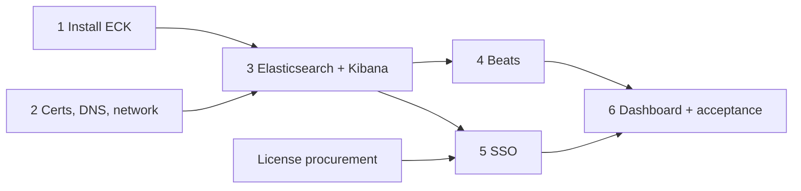

# Elastic epic — tickets

Six tracking tickets. **Done when** closes the ticket; **Depends on** is a hard dependency.

---

### 1 — Install ECK on aks-1
Stage images and ECK manifests on the connected side (`mirror-images.sh pull`), transfer, push to
the Gov ACR (`mirror-images.sh push`). Install CRDs + operator: `./scripts/deploy.sh operator`.
**Done when:** `elastic-operator` Running in `elastic-system`, pulling from the Gov ACR.
**Depends on:** —

### 2 — Certificates, DNS, and network paths
Request `kibana.iguana.internal` and `elasticsearch.iguana.internal` from the Iguana dog-ops Issuing CA;
create `kibana-tls` and `elasticsearch-tls` in `aks-istio-ingress`. A records for both → aks-1 internal
gateway IP. Firewall change: atl-aks and gl-aks → aks-1 gateway, TCP 443.
**Done when:** both names resolve and complete a TLS handshake from aks-1, atl-aks, and gl-aks.
**Depends on:** — *(mostly other teams — request early)*

### 3 — Deploy Elasticsearch and Kibana
`./scripts/deploy.sh stack` — STRICT mTLS, StorageClass, Elasticsearch, Kibana, Istio gateway.
Apply the 30-day ILM policy; configure the Azure snapshot repository and nightly snapshots.
**Done when:** ES green; STRICT verified (a pod without a sidecar cannot reach ES); both URLs work
through the gateway with the Iguana cert; one snapshot succeeds.
**Depends on:** 1, 2 (certs needed for the gateway part only)

### 4 — Deploy Beats to the monitored clusters
Decide spoke delivery (plain manifests vs ECK). Metricbeat + Heartbeat on aks-1 first — measure
daily growth and resize disks if needed — then atl-aks and gl-aks (per-cluster write-only API key,
Iguana CA trust), then the Azure metrics module.
**Done when:** data from all three clusters and Azure visible in Kibana.
**Depends on:** 3

### 5 — Kibana single sign-on with Entra ID
Apply the Enterprise license (`LICENSE_FILE=… ./scripts/deploy.sh operator`). Entra enterprise app,
SAML realm and Kibana provider (reference: `manifests/saml-realm.example.yaml`). Decide the tenant
isolation model; map Entra group object IDs to roles and spaces. Keep basic login for break-glass.
**Done when:** a tenant signs in with their Snail account and sees only what their role allows.
**Depends on:** 3, license procurement

### 6 — Uptime dashboard and acceptance
Build the baseline uptime/availability dashboard; export saved objects to `dashboards/`.
Demonstrate AC1 and AC2 to the ticket owner from a **tenant** SSO account.
**Done when:** both ACs witnessed; date and witness recorded in `elastic.md`.
**Depends on:** 4, 5
