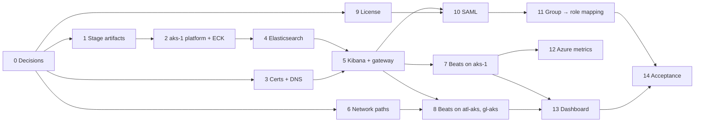

# Elastic epic — ticket breakdown

One section per tracking ticket. **Done when** is the closing criterion; **Blocked by** lists
hard dependencies. Tickets on the same row of the dependency graph can run in parallel.

---

### 0 — Design decisions and approvals
Resolve the *Open decisions* in `README.md`: tenant isolation, remote Beats delivery,
retention, Azure metrics access. **Resolve the certificate conflict** for `elasticsearch.iguana.internal`.
~~TLS model~~ (Istio) · ~~StorageClass~~ · ~~hostnames~~ decided.
**Start the long-lead items here:** license procurement (ticket 9), cert request (ticket 3),
firewall change request (ticket 6).
**Done when:** every open decision has a written answer in `README.md`.

### 1 — Stage artifacts (connected side)
`./scripts/mirror-images.sh pull` — images and ECK CRDs/operator manifests into `cache/`.
Bundle with the `crane` binary, transfer to the air-gapped host.
**Blocked by:** 0 (version confirmation)
**Done when:** every image in `images.txt` and every file in `manifests.txt` is in `cache/` on the air-gapped host.

### 2 — aks-1 platform prep and ECK operator
Verify aks-1 environment facts (Istio revision, gateway, mTLS mode, ACR attachment) and
update `README.md`. Push images to ACR (`mirror-images.sh push`, arch verified amd64).
Create `managed-csi-premium-retain` after diffing against `managed-csi-premium`.
Install CRDs and operator (first half of `deploy.sh`).
**Blocked by:** 1
**Done when:** `elastic-operator` Running in `elastic-system`; operator config shows the Gov ACR as `container-registry`.

### 3 — Certificates and DNS
Request `kibana.snail.internal` from the **Iguana dog-ops Issuing CA**, and `elasticsearch.iguana.internal`
from whichever CA the README conflict note resolves to.
Create `kibana-tls` and `elasticsearch-tls` in `aks-istio-ingress`. A records for both → aks-1 internal gateway IP.
**Blocked by:** 0 (certificate conflict resolved)
**Done when:** both secrets exist; SANs verified with `openssl x509 -ext subjectAltName`; both names resolve from aks-1, atl-aks, and gl-aks.

### 4 — Elasticsearch
Deploy via `deploy.sh`. Configure snapshot repository and ILM retention per ticket 0.
**Blocked by:** 2
**Done when:** `kubectl get elasticsearch` HEALTH green; all PVCs Bound; one snapshot succeeds; ILM policy attached.

### 5 — Kibana and gateway exposure
Deploy Kibana and apply `manifests/istio.yaml` (Gateway + VirtualServices; no DestinationRules — the
mesh handles gateway→pod mTLS). Confirm the gateway selector label on aks-1 first.
**Blocked by:** 3, 4
**Done when:** `https://kibana.snail.internal/api/status` → 200 and `https://elasticsearch.iguana.internal` answers, both through the gateway with the Iguana cert presented; `elastic` user can log in.

### 6 — Network paths from monitored clusters
Firewall / NSG / UDR change: atl-aks and gl-aks egress → aks-1 internal gateway IP, TCP 443.
**Blocked by:** 0 (gateway IP known from ticket 3)
**Done when:** `curl -v https://elasticsearch.iguana.internal` from a pod in each spoke completes the TLS handshake.

### 7 — Metricbeat and Heartbeat on aks-1
Beat CRs with `elasticsearchRef` (same cluster). Kubernetes module; Heartbeat monitors for aks-1 TEST services.
**Blocked by:** 5
**Done when:** `metricbeat-*` and `heartbeat-*` data from aks-1 visible in Kibana Discover.

### 8 — Metricbeat and Heartbeat on atl-aks and gl-aks
Per-cluster API key (write-only to Beat indices), Iguana CA trust in the Beat pods, output to `elasticsearch.iguana.internal:443`.
**Blocked by:** 5, 6
**Done when:** data from both spokes visible in Kibana, tagged with its source cluster.

### 9 — Enterprise license
Procure and apply (`LICENSE_FILE=… ./scripts/deploy.sh`).
**Blocked by:** procurement
**Done when:** `GET /_license` shows `type: enterprise`, status `active`.

### 10 — Kibana SAML with Entra ID
Entra enterprise app, federation metadata as a ConfigMap, SAML realm in ES, providers in Kibana.
Reference: `manifests/saml-realm.example.yaml`.
**Blocked by:** 5, 9
**Done when:** a Snail account signs in to Kibana through Entra; basic login still works for break-glass.

### 11 — Entra group → Kibana role mappings
Roles and Kibana spaces per decision 2; role mappings keyed on group object IDs.
**Blocked by:** 10
**Done when:** a member of each mapped group signs in and sees exactly what their role allows — and a non-member is refused.

### 12 — Azure metrics
Metricbeat `azure` module; service principal and Azure Monitor API reachability per decision 5.
**Blocked by:** 7, decision 5
**Done when:** Azure resource metrics visible in Kibana.

### 13 — Baseline uptime and availability dashboard
Build in Kibana, export saved objects to `dashboards/` as NDJSON so it is versioned and re-importable.
**Blocked by:** 7, 8
**Done when:** dashboard shows up/down and availability % per TEST service across all three clusters; export committed.

### 14 — Acceptance
From a **tenant SSO account**, not an admin: demonstrate AC1 and AC2 to the ticket owner.
**Blocked by:** 11, 13
**Done when:** both witnessed; date and witness recorded in `elastic.md`.
