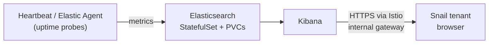

# Deploying elastic (Elasticsearch + Kibana)

Step-by-step guide for deploying the monitoring stack to AKS in Azure Government (TEST CUI).

> **Status: skeleton.** The air-gap transfer, ACR, Istio, TLS, and DNS steps below are the
> sequence proven on `code-marketplace` and can be followed as written. Steps marked
> **TODO** depend on the open decisions in `README.md` and must not be run until resolved.

**Audience:** anyone on the team. If you can run `kubectl` and `helm`, you can do this.

---

## What this is

Elasticsearch stores uptime and availability metrics for TEST tenants; Kibana is the UI.
Elasticsearch is a **StatefulSet with persistent volumes** — unlike `code-marketplace`,
this service has state, and sizing and backup decisions are not reversible for free.



**Key facts**
- **Stateful** — PVCs on an Azure StorageClass. Node count and disk size decided in Phase 0.
- **Air-gapped** — every image mirrored to Gov ACR via `crane`. No runtime egress.
- **Secured by default** — ES 8.x enables TLS and auth. Credentials live in a Kubernetes secret.
- **Kibana only is exposed** — through `aks-istio-ingressgateway-internal` with an org-PKI cert.
- **Tenant-scoped** — Snail tenant gets a Kibana space + role, not superuser.

---

## Delivery phases

Each phase maps to one tracking ticket. Verification criteria are what closes the ticket.

| # | Phase | Closes when |
|---|---|---|
| 0 | Decisions & design | Every *Open decision* in `README.md` has an answer written down |
| 1 | Artifact staging (connected side) | `cache/` has every image in `images.txt`, bundle transferred |
| 2 | Platform prerequisites (air-gap side) | Images in ACR (arch verified), StorageClass confirmed, namespace labeled, cert + DNS in place, operator installed |
| 3 | Elasticsearch | Cluster health **green**, PVCs bound, credentials retrievable, snapshot repo configured |
| 4 | Kibana + exposure | `https://<kibana-host>/api/status` returns 200 through the gateway, login works |
| 5 | Monitoring data | Uptime data for at least one TEST target visible in a Kibana dashboard |
| 6 | Compliance & operations | ILM retention, snapshot schedule, audit logging, `check-status.sh` finalized, runbook as-built |
| 7 | Acceptance | AC1 and AC2 demonstrated to the ticket owner from a tenant account |

---

## Phase 0 — Decisions (TODO)

Resolve every item in `README.md → Open decisions`. Recommendation for the first one:

**Use ECK (Elastic Cloud on Kubernetes).** Elastic's standalone Helm charts are deprecated
for 8.x. ECK gives you Elasticsearch and Kibana as CRDs with the operator handling TLS,
credentials, rolling upgrades, and PVC management. Cost: CRDs and an operator deployment
need cluster-level permissions — confirm that is acceptable in TEST CUI before committing.

Record the answers in `README.md`, then fill in `images.txt`, `service.conf`, and the
install step in `scripts/deploy.sh`.

---

## Phase 1 — Connected side: stage artifacts

```bash
cd services-main/elastic
./scripts/mirror-images.sh pull          # crane pull --platform linux/amd64 per images.txt
# TODO: also fetch ECK operator manifests (or charts, per charts.txt) into ./cache/
tar -czf elastic-bundle.tar.gz cache/ crane
scp elastic-bundle.tar.gz <user>@<airgap-host>:~/
```

`crane` itself goes in the bundle — the air-gapped host has no docker CLI and
`az acr login` depends on it.

---

## Phase 2 — Air-gap side: prerequisites

```bash
tar -xzf ~/elastic-bundle.tar.gz -C services-main/elastic/
cd services-main/elastic
export ACR_NAME=<gov-acr-name>
./scripts/mirror-images.sh push          # pushes + verifies architecture is amd64/linux
```

**Storage** — confirm the class exists and note its reclaim policy before creating any PVC:
```bash
kubectl get storageclass
```

**Namespace + Istio** — `deploy.sh` does this, but it is safe to do early:
```bash
kubectl create ns elastic
kubectl label ns elastic istio.io/rev=asm-1-29 --overwrite
```

**TLS for Kibana** — the long-lead item; request it first. The secret goes in the
**gateway's** namespace, not `elastic`:
```bash
openssl x509 -in kibana-fullchain.crt -noout -ext subjectAltName -dates   # SAN must match hostname
kubectl -n aks-istio-ingress create secret tls kibana-tls --cert=kibana-fullchain.crt --key=kibana.key
```

**DNS** — A record for the Kibana hostname → the internal gateway IP:
```bash
kubectl -n aks-istio-ingress get svc aks-istio-ingressgateway-internal -o jsonpath='{.status.loadBalancer.ingress[0].ip}{"\n"}'
```

**Operator** (ECK path, TODO):
```bash
kubectl apply -f cache/eck-crds.yaml
kubectl apply -f cache/eck-operator.yaml
kubectl -n elastic-system get pods        # operator Running before continuing
```

---

## Phase 3 — Elasticsearch (TODO)

Deploy the Elasticsearch CR (or Helm release), then verify:

```bash
kubectl -n elastic get elasticsearch      # HEALTH must be green
kubectl -n elastic get pvc                # all Bound
```

Read the generated password **inside the cluster** — do not pass it on a `kubectl` command
line, that lands in container logs:
```bash
kubectl -n elastic get secret <es-name>-es-elastic-user -o go-template='{{.data.elastic | base64decode}}'
```

Configure a snapshot repository (Azure blob) now — it is a compliance requirement, and
adding it before there is data means the first snapshot proves the path.

---

## Phase 4 — Kibana + exposure (TODO)

Deploy the Kibana CR, then create the Istio routing in `manifests/`:

- `Gateway` — selector `istio: aks-istio-ingressgateway-internal`, HTTPS 443 with
  `credentialName: kibana-tls`, HTTP 80 with `httpsRedirect: true`
- `VirtualService` — host → `<kibana-svc>.elastic.svc.cluster.local:5601`

Test before DNS propagates:
```bash
IP=$(kubectl -n aks-istio-ingress get svc aks-istio-ingressgateway-internal -o jsonpath='{.status.loadBalancer.ingress[0].ip}')
curl -v --resolve "<kibana-host>:443:$IP" "https://<kibana-host>/api/status"
```

A TLS handshake failure here is almost always the secret in the wrong namespace or a SAN mismatch.

---

## Phase 5 — Monitoring data (TODO — confirm scope)

The value statement needs uptime/availability data for TEST targets. Deploy **Heartbeat**
(HTTP/TCP/ICMP probes) or **Elastic Agent** with the Uptime integration, targeting the
TEST endpoints the tenant cares about. Verify indices are being written, then build the
Kibana dashboard the tenant will actually use.

Create a Kibana **space** and a **role** scoped to the tenant's indices. Do not hand out
the `elastic` superuser.

---

## Phase 6 — Compliance & operations (TODO)

- **ILM** retention policy matching the SLA/Cyber retention requirement
- **Snapshot schedule** (SLM) to the Azure repository from Phase 3
- **Audit logging** enabled in Elasticsearch
- Finalize `scripts/check-status.sh` with the real ES service name and a health probe
- Update this runbook to as-built — every TODO resolved, every value real

---

## Phase 7 — Acceptance

From a **tenant** account, not an admin account:

- [ ] **AC1** — Elasticsearch reachable, indices for the tenant's targets present and current
- [ ] **AC2** — Kibana reachable at its hostname over TLS, tenant sees the uptime dashboard

Demonstrate both to the ticket owner. Record the date and who witnessed it below.

---

## Rollback

ECK: `kubectl -n elastic delete elasticsearch/<name> kibana/<name>` removes the workloads.
**PVCs are retained by default** — that is deliberate; the data survives. Delete them
explicitly only when you mean to destroy the cluster's data.

---

## Reference

| Cluster resource | Name |
|---|---|
| Namespace | `elastic` |
| Istio revision | `asm-1-29` |
| Kibana TLS secret | `kibana-tls` in `aks-istio-ingress` |
| Credentials secret | `elastic-credentials` in `elastic` |

Upstream: https://www.elastic.co/guide/en/cloud-on-k8s/current/index.html
